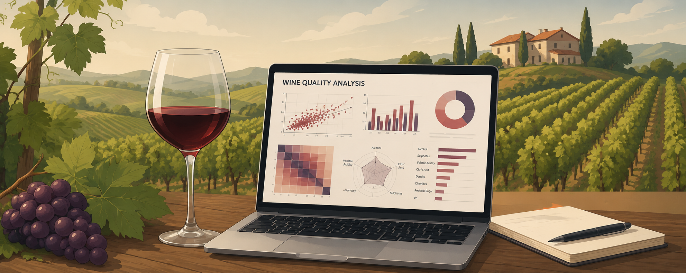
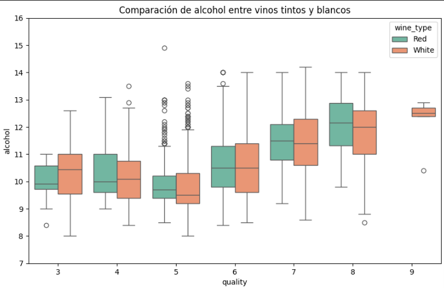
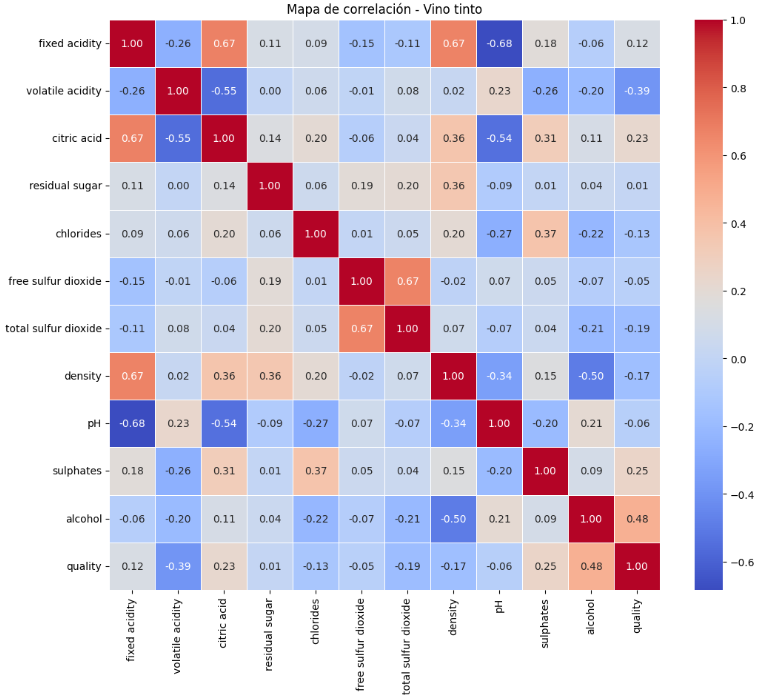
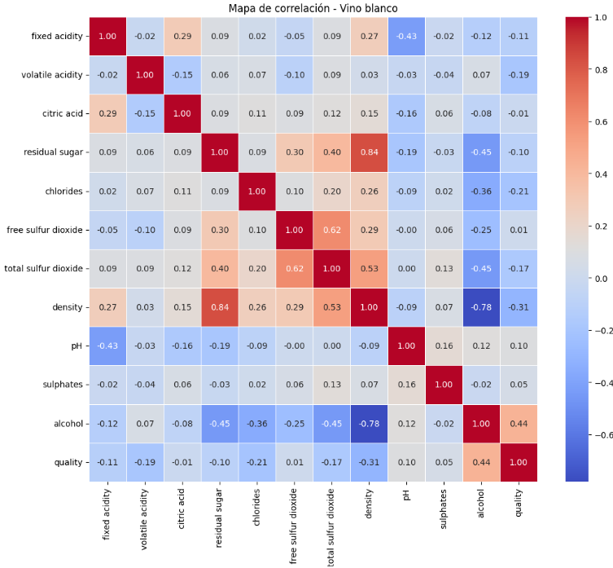
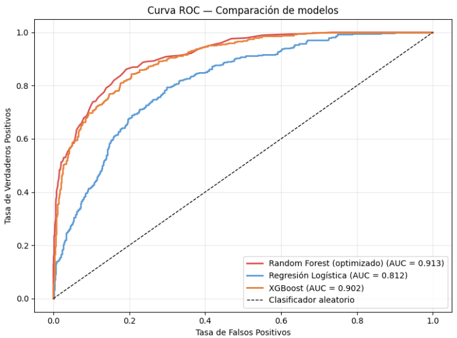

# 🍷 Wine Quality Analysis & Machine Learning

## 📌 Project Overview

This project focuses on analyzing physicochemical properties of wine and building Machine Learning models capable of predicting wine quality scores.

Using data analysis, visualization techniques, and classification algorithms, this project explores how features such as alcohol content, acidity, pH, sulphates, and density influence wine quality.

The project combines:
- Exploratory Data Analysis (EDA)
- Statistical analysis
- Data visualization
- Feature engineering
- Machine Learning classification models
- Model evaluation and comparison

---

## 🎯 Objectives

The main goals of this project are:

- Analyze wine physicochemical characteristics
- Identify the variables most correlated with quality
- Detect patterns and trends within the dataset
- Build predictive Machine Learning models
- Evaluate model performance using classification metrics
- Improve understanding of feature importance in wine quality prediction

---

## 📊 Dataset Information

The dataset contains physicochemical measurements of wine samples along with quality scores assigned by wine experts.

### Main Features

| Feature | Description |
|---|---|
| Fixed Acidity | Non-volatile acids |
| Volatile Acidity | Acetic acid concentration |
| Citric Acid | Freshness contributor |
| Residual Sugar | Sugar remaining after fermentation |
| Chlorides | Salt concentration |
| Free Sulfur Dioxide | Free SO₂ content |
| Total Sulfur Dioxide | Total SO₂ content |
| Density | Wine density |
| pH | Acidity/basicity level |
| Sulphates | Preservation additive |
| Alcohol | Alcohol percentage |
| Quality | Wine quality score |

---

## 🛠️ Technologies Used

- Python
- Pandas
- NumPy
- Matplotlib
- Seaborn
- Scikit-learn
- Jupyter Notebook

---

## 🔎 Exploratory Data Analysis

The EDA phase included:

- Distribution analysis
- Correlation heatmaps
- Outlier detection
- Feature relationship analysis
- Quality score distribution
- Statistical summaries

### Key Findings

✅ Alcohol content showed positive correlation with wine quality

✅ Volatile acidity negatively impacted quality scores

✅ Some features presented strong predictive power for classification models

✅ Data preprocessing significantly improved model performance

---

## 🤖 Machine Learning Models

The project explores different classification algorithms, including:

- Random Forest Classifier
- Logistic Regression
- XGBoost

### Evaluation Metrics

- Accuracy
- Precision
- Recall
- F1-score
- Confusion Matrix

---

## 📈 Project Workflow

### 1️⃣ Data Cleaning & Preparation
- Missing value inspection
- Feature selection
- Data preprocessing
- Scaling

### 2️⃣ Exploratory Data Analysis
- Visual analysis
- Correlation analysis
- Outlier identification

### 3️⃣ Model Development
- Train-test split
- Model training
- Hyperparameter experimentation

### 4️⃣ Model Evaluation
- Performance comparison
- Metrics analysis
- Model interpretation

---

## 🚀 Future Improvements

- Hyperparameter tuning
- Cross-validation optimization
- Feature engineering improvements
- Streamlit deployment
- MLOps integration
- Experiment tracking
- Cloud deployment

---

## 📂 Repository Structure

Wine_Quality/
│
├── data/
├── notebook/
├── images/
├── README.md
├── requirements.txt
└── Wine_Quality.ipynb

---

## ▶️ Installation

Clone the repository: git clone https://github.com/PameW/Wine_Quality.git

Install dependencies: pip install -r requirements.txt

Run Jupyter Notebook: jupyter notebook

---

## 💡 About This Project

This project is part of my Data Science portfolio and reflects my continuous learning journey in:

- Machine Learning
- Predictive Analytics
- Data Visualization
- Industrial & Food Data Applications

The workflow and repository structure were also refined through iterative improvements and AI-assisted development tools.

---

👩‍💻 Author: Pamela Wasserman

- Data Scientist
- Food Engineer
- Interested in Machine Learning, MLOps & AI applications

---